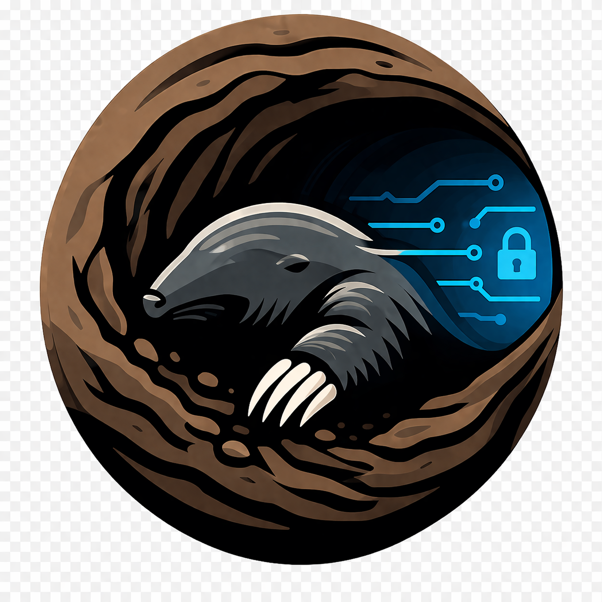

<p align="center">
  
</p>

<h1 align="center">Bore</h1>

<p align="center">
  <strong>SSH tunnel manager that just works.</strong><br/>
  One daemon. Four interfaces. All your tunnels, always connected.
</p>

<p align="center">
  <a href="#installation">Installation</a> &bull;
  <a href="#quick-start">Quick Start</a> &bull;
  <a href="#features">Features</a> &bull;
  <a href="#interfaces">Interfaces</a> &bull;
  <a href="#configuration">Configuration</a> &bull;
  <a href="#contributing">Contributing</a>
</p>

---

Bore is an open-source SSH tunnel manager built in Go. It runs a lightweight background daemon that keeps your tunnels alive, reconnects them when they drop, and lets you control everything from a CLI, a terminal UI, or a desktop app.

If you've ever lost a database connection because your laptop went to sleep, or you're tired of managing a dozen `ssh -L` commands across terminals, Bore is for you.

## Why Bore?

- **Tunnels survive terminal closures.** The daemon runs in the background. Close your terminal, close your laptop lid -- your tunnels reconnect automatically.
- **One config, all your tunnels.** Define everything in a single YAML file. `bore up dev` connects your entire development environment in one shot.
- **Multiple interfaces, same daemon.** CLI for scripting, TUI for monitoring, desktop GUI for convenience. They all talk to the same daemon.
- **Not just SSH.** Bore also manages Kubernetes port-forwards, SOCKS5 proxies, and multi-hop jump host chains with the same interface.

## Features

- **Local, remote, and dynamic (SOCKS5) SSH tunnels**
- **Kubernetes port-forward** with the same lifecycle management as SSH tunnels
- **Auto-reconnect** with exponential backoff and jitter
- **SSH connection multiplexing** -- multiple tunnels through the same bastion share one connection
- **Jump host chains** -- multi-hop `ProxyJump`-style connections
- **Health monitoring** with SSH keepalives (healthy / degraded / dead)
- **Tunnel groups** -- organize related tunnels and batch connect/disconnect
- **Pre/post-connect hooks** -- run scripts when tunnels connect (migrations, notifications, etc.)
- **Config hot-reload** -- edit the YAML, daemon picks up changes automatically
- **Import from `~/.ssh/config`** -- migrate existing SSH tunnels in one command
- **Tailscale integration** -- detects Tailscale status and MagicDNS addresses
- **SSH agent, key file, and certificate auth** with composite fallback
- **Cross-platform** -- Linux, macOS, Windows (amd64 and arm64)

## Interfaces

Bore has four interfaces, all backed by the same daemon:

| Interface | What it is | Best for |
|-----------|-----------|----------|
| **CLI** (`bore`) | Command-line tool | Scripting, quick operations, CI/CD |
| **TUI** (`bore-tui`) | Interactive terminal dashboard | Monitoring, keyboard-driven workflows |
| **Desktop** (`bore-desktop`) | Native desktop app (Wails + React) | Visual management, casual use |
| **Daemon** (`bored`) | Background service | Runs automatically, manages all tunnel lifecycles |

## Installation

Download the latest release from [**GitHub Releases**](https://github.com/hyperplex-tech/bore/releases).

Every release includes installers and standalone binaries for all major platforms and architectures:

| Platform | Architectures | Installer | Standalone binaries |
|----------|--------------|-----------|-------------------|
| **Linux** | x86_64 (amd64), ARM64 | `.deb` | `bore-linux-{amd64,arm64}.tar.gz` |
| **macOS** | Apple Silicon (arm64), Intel (amd64) | `.dmg` | `bore-darwin-{arm64,amd64}.tar.gz` |
| **Windows** | x86_64 (amd64), ARM64 | `.exe` installer | `bore-windows-{amd64,arm64}.zip` |

> **Note:** The Linux ARM64 `.deb` includes CLI, daemon, and TUI. The desktop GUI is only available in the amd64 `.deb` (it requires native webkit2gtk).

### Linux (.deb)

```bash
# x86_64
sudo dpkg -i bore_*_amd64.deb

# ARM64 (Raspberry Pi, AWS Graviton, etc.)
sudo dpkg -i bore_*_arm64.deb

# Then enable the daemon
systemctl --user enable --now bored
```

The daemon runs as a **systemd user service** (not system-wide). Check it with `systemctl --user status bored`.

### macOS (.dmg)

Download the `.dmg` for your Mac:
- **Apple Silicon** (M1/M2/M3/M4): `Bore-*-arm64.dmg`
- **Intel**: `Bore-*-amd64.dmg`

Open it and:

1. Drag **Bore.app** to Applications
2. Clear the quarantine flag (required because the app is not yet code-signed):
   ```bash
   xattr -cr /Applications/Bore.app
   ```
3. Double-click **Install CLI Tools** to set up `bore`, `bored`, and `bore-tui` in your PATH and register the background daemon

### Windows (.exe installer)

Download the installer for your architecture:
- **x86_64**: `Bore-Setup-*-amd64.exe`
- **ARM64** (Surface Pro X, Snapdragon laptops): `Bore-Setup-*-arm64.exe`

The installer:

- Installs all binaries and creates Start Menu shortcuts
- Registers the daemon to auto-start on login
- Optionally adds bore to your PATH

Uninstall from "Add or Remove Programs" in Windows Settings.

### From source

```bash
git clone https://github.com/hyperplex-tech/bore.git
cd bore
make install
```

See [DEVELOPERS.md](DEVELOPERS.md) for prerequisites and build details.

## Quick Start

**1. Start the daemon** (if not already running via the installer):

```bash
bored &
# or: systemctl --user start bored
```

**2. Add a tunnel:**

```bash
bore add my-db \
  --local-port 5432 \
  --remote-host db.internal \
  --remote-port 5432 \
  --via bastion.example.com
```

**3. Connect it:**

```bash
bore up my-db
```

**4. Check status:**

```bash
bore status
```

```
NAME       GROUP    STATUS   LOCAL              REMOTE                    VIA                    UPTIME
my-db      default  active   127.0.0.1:5432     db.internal:5432          bastion.example.com    2m 15s
```

**5. Or connect everything at once:**

```bash
bore up            # all tunnels
bore up dev        # just the "dev" group
```

## CLI Reference

```bash
# Tunnel operations
bore up [group]                 # Connect tunnels (all, or by group)
bore down [group]               # Disconnect tunnels
bore status                     # List all tunnels with status
bore pause <name>               # Pause a tunnel (graceful disconnect)
bore retry <name>               # Retry a failed tunnel
bore logs <name> [-f] [-n 50]   # Tail tunnel logs

# Configuration
bore add <name> [flags]         # Add a tunnel
bore delete <name>              # Remove a tunnel
bore edit                       # Open config in $EDITOR
bore import                     # Import from ~/.ssh/config

# Groups
bore group list                 # List groups
bore group add <name>           # Create a group
bore group rename <old> <new>   # Rename a group
bore group delete <name>        # Delete an empty group

# Daemon
bore daemon start               # Start the daemon
bore daemon stop                # Stop the daemon
bore daemon status              # Show daemon info
```

## Configuration

Bore uses a single YAML config file:

| Platform | Path |
|----------|------|
| Linux | `~/.config/bore/tunnels.yaml` |
| macOS | `~/Library/Application Support/bore/tunnels.yaml` |
| Windows | `%APPDATA%\Bore\tunnels.yaml` |

XDG environment variables are respected on Linux and macOS.

### Example config

```yaml
version: 1

defaults:
  ssh_port: 22
  ssh_user: ubuntu
  auth_method: agent
  reconnect: true
  reconnect_max_interval: 60s
  keepalive_interval: 30s
  keepalive_max_failures: 3

groups:
  dev:
    description: "Development environment"
    tunnels:
      - name: dev-postgres
        type: local
        local_port: 5432
        remote_host: db.internal
        remote_port: 5432
        ssh_host: bastion.dev.example.com

      - name: dev-redis
        type: local
        local_port: 6379
        remote_host: redis.internal
        remote_port: 6379
        ssh_host: bastion.dev.example.com

  k8s:
    tunnels:
      - name: staging-api
        type: k8s
        local_port: 8080
        remote_port: 8080
        k8s_context: staging
        k8s_namespace: default
        k8s_resource: svc/api-server

  proxy:
    tunnels:
      - name: socks-proxy
        type: dynamic
        local_port: 1080
        ssh_host: bastion.example.com
```

### Tunnel types

| Type | Description | Example use case |
|------|-------------|-----------------|
| `local` | Forward a local port to a remote host through SSH | Database, Redis, internal APIs |
| `remote` | Forward a remote port back to your local machine | Exposing a local dev server |
| `dynamic` | SOCKS5 proxy through SSH | Route all traffic through a bastion |
| `k8s` | Kubernetes port-forward with lifecycle management | Cluster services without SSH |

### Hooks

Run commands before or after a tunnel connects:

```yaml
tunnels:
  - name: prod-db
    type: local
    local_port: 5432
    remote_host: db.prod
    remote_port: 5432
    ssh_host: bastion.prod.example.com
    hooks:
      pre_connect: "echo 'Connecting to prod...'"
      post_connect: "psql -c 'SELECT 1'"
```

Hooks receive environment variables: `BORE_TUNNEL_NAME`, `BORE_GROUP`, `BORE_LOCAL_HOST`, `BORE_LOCAL_PORT`, `BORE_REMOTE_HOST`, `BORE_REMOTE_PORT`, `BORE_SSH_HOST`, `BORE_SSH_PORT`, `BORE_SSH_USER`, `BORE_STATUS`.

### Jump hosts

Multi-hop SSH connections:

```yaml
tunnels:
  - name: internal-db
    type: local
    local_port: 5432
    remote_host: db.internal
    remote_port: 5432
    ssh_host: target.internal
    jump_hosts:
      - bastion.example.com
      - internal-bastion.example.com
```

### Import from SSH config

Already have tunnels defined in `~/.ssh/config`? Import them:

```bash
bore import --dry-run          # preview what would be imported
bore import --group imported   # import into a group
```

Bore parses `Host`, `HostName`, `User`, `Port`, `IdentityFile`, `ProxyJump`, and `LocalForward` directives.

## How It Works

```
 CLI / TUI / Desktop
        |
        | gRPC over Unix socket (Linux/macOS) or named pipe (Windows)
        |
   +---------+
   | Daemon  |  ← background service, manages all tunnel lifecycles
   | (bored) |
   +---------+
        |
        |--- SSH tunnels (local/remote/dynamic) via golang.org/x/crypto/ssh
        |--- K8s port-forwards via kubectl
        |--- Connection multiplexing (shared SSH connections)
        |--- Health monitoring (keepalives, auto-reconnect)
        |--- Config watching (hot-reload on file change)
        |--- Event bus (real-time state updates to all clients)
```

For a deeper technical dive, see [OVERVIEW.md](OVERVIEW.md).

## Contributing

Contributions are welcome! Fork the repo, create a branch, and open a PR. See [CONTRIBUTING.md](CONTRIBUTING.md) for the full workflow.

```bash
# Set up dependencies
./scripts/dev-setup.sh

# Start the dev daemon (uses a separate socket, won't conflict with production)
make dev

# In another terminal, interact with it
BORE_SOCKET=$(pwd)/bin/bored-dev.sock ./bin/bore status

# Run tests
make test
make lint
```

See [DEVELOPERS.md](DEVELOPERS.md) for build prerequisites and all Makefile targets.

### CI/CD

Every push to `main` and every pull request runs tests, linting, and builds across all platforms via GitHub Actions. Tagged releases (`v*`) automatically build and publish installers for all platforms and architectures to GitHub Releases.

### Project structure

```
bore/
  cmd/           CLI, daemon, TUI, desktop entry points
  internal/      Core logic (engine, auth, config, health, hooks, IPC, ...)
  api/proto/     gRPC service definitions (protobuf)
  gen/           Generated protobuf Go code
  desktop/       Wails desktop app (React + TypeScript + Tailwind)
  scripts/       Build, install, and dev setup scripts
  assets/        Icons and branding
```

## License

[MIT](LICENSE) -- Hyperplex Technologies
